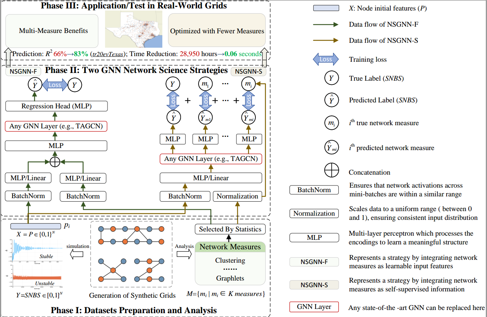

# Network Measure-Enriched Graph Neural Networks: A New Benchmark for Power Grid Stability Assessment



Can network measures enhance the predictive capability of Graph Neural Networks (GNNs) for the stability of power grids, and can they aid in the generalization of models to real-world networks?

The answer is affirmative. In our paper, we present, for the first time, a benchmark that analyzes 48 network measures within the context of GNN-based stability assessments, introducing two strategies for their integration into the GNN framework: NSGNN-F and NSGNN-S.

Our findings reveal that prioritizing measures with consistent distributions across different grids as inputs or treating measures as auxiliary supervised information significantly improves the model’s generalization ability to realistic grid topologies.

In this *NSGNN* package we provide several Network Measure encodings and GNN model choices, implementing for both NSGNN-F and NSGNN-S. One can easily try our model with different GNN layer or different combination of network measures. NSGNN is built based on [PyG](https://www.pyg.org/), [GraphGym](https://pytorch-geometric.readthedocs.io/en/2.0.0/notes/graphgym.html) from PyG2, and [GraphGPS](https://github.com/rampasek/GraphGPS). We thank them for providing the codes and tools.
Specifically *PyG v2.2* is required.


### Python environment setup with Conda

```bash
conda create -n nsgnn python=3.10
conda activate nsgnn

conda install pytorch=1.13 torchvision torchaudio pytorch-cuda=11.7 -c pytorch -c nvidia
conda install pyg=2.2 -c pyg -c conda-forge
pip install pyg-lib -f https://data.pyg.org/whl/torch-1.13.0+cu117.html

conda install openbabel fsspec rdkit -c conda-forge

pip install pytorch-lightning yacs torchmetrics
pip install performer-pytorch
pip install tensorboardX
pip install ogb

conda clean --all
```

### Datasets

Our datasets are available on the drive and will be downloaded automatically when you execute our project. Our datasets including **dataset20**, **dataset100**, **Texas**, **Spain**, **Germany**, and **France** power grids.

### Running NSGNN-F
```bash
conda activate nsgnn

# Running NSGNN-F with GraphSAGE layer and some combination of measures for training on dataset20 and testing on Texas.
python main.py --cfg configs/NSGNN-F/SAGE-F-tr20teTexas-NetSci.yaml

# Running NSGNN-F with TAGCN layer and random walk structural encoding for training on dataset20 and testing on Texas.
python main.py --cfg configs/NSGNN-F/TAGCN-F-tr20teTexas-NRWSE.yaml

#Running NSGNN-F for only inference.
python main.py --cfg tests/NSGNN-F/TAGCN-F-tr100teTexas-NRWSE-inference.yaml
```

### Running NSGNN-S
```bash
conda activate nsgnn
# Running NSGNN-S with ARMA layer with random walk structural encoding
python main.py --cfg configs/NSGNN-S/ARMA-S-tr100teTexas-NRWSE.yaml
# Running NSGNN-S with TAGCN layer with random walk structural encoding
python main.py --cfg configs/NSGNN-S/TAGCN-S-tr100teTexas-NRWSE.yaml
```

