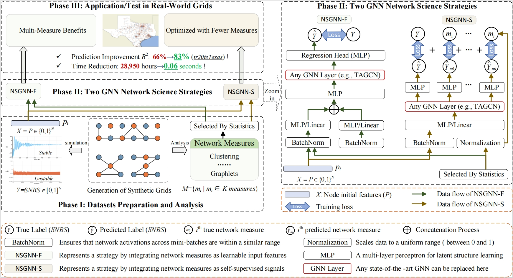

# Network Measure-Enriched Graph Neural Networks: A New Benchmark for Power Grid Stability Assessment



Can network measures enhance the predictive capability of Graph Neural Networks (GNNs) for the stability of power grids, and can they aid in the generalization of models to real-world networks?

The answer is affirmative. In our paper, we present, for the first time, a benchmark that analyzes 48 network measures within the context of GNN-based stability assessments, introducing two strategies for their integration into the GNN framework: NSGNN-F and NSGNN-S.

Our findings reveal that prioritizing measures with consistent distributions across different grids as inputs or treating measures as auxiliary supervised information significantly improves the model’s generalization ability to realistic grid topologies.

In this *NSGNN* package we provide several Network Measure encodings and GNN model choices, implementing for both NSGNN-F and NSGNN-S. One can easily try our model with different GNN layer or different combination of network measures. NSGNN is built based on [PyG](https://www.pyg.org/), [GraphGym](https://pytorch-geometric.readthedocs.io/en/2.0.0/notes/graphgym.html) from PyG2, and [GraphGPS](https://github.com/rampasek/GraphGPS). We thank them for providing the codes and tools.
Specifically *PyG v2.2* is required.

## Summary of 48 Network Measures
Summary of 48 network measures evaluated, categorized into Nodal and Global types and indexed serially. Each entry includes measure names or definitions with relevant citations.

### Nodal

<table>
  <thead>
    <tr>
      <th>Name / Definition</th>
      <th>Name / Definition</th>
      <th>Name / Definition</th>
      <th>Name / Definition</th>
    </tr>
  </thead>
  <tbody>
    <tr>
      <td>0. injected power P</td>
      <td>1. AP</td>
      <td>2. A²P</td>
      <td>3. A³P</td>
    </tr>
    <tr>
      <td>4. betweenness centrality</td>
      <td>5. Katz centrality (<small>networkx</small>)</td>
      <td>6. degree centrality</td>
      <td>7. A&#x1D538;</td>
    </tr>
    <tr>
      <td>8. minimum neighbor degree</td>
      <td>9. maximum neighbor degree</td>
      <td>10. clustering coefficient</td>
      <td>11. A² &#x1D538;</td>
    </tr>
    <tr>
      <td>12. closeness centrality</td>
      <td>13. load centrality (<small>networkx</small>)</td>
      <td>14. eigenvector centrality</td>
      <td>15. A³ &#x1D538;</td>
    </tr>
    <tr>
      <td>16. second-order centrality (<small>networkx</small>)</td>
      <td>17. current-flow close centrality</td>
      <td>18. sparse sprout</td>
      <td>19. bulk</td>
    </tr>
    <tr>
      <td>20. harmonic centrality (<small>networkx</small>)</td>
      <td>21. square clustering (<small>networkx</small>)</td>
      <td>22. Fiedler eigenvector</td>
      <td>23. root</td>
    </tr>
    <tr>
      <td>24. resistance distance centrality</td>
      <td>25. current-flow betweenness centrality</td>
      <td>26. inner tree node</td>
      <td>27. proper leaf</td>
    </tr>
    <tr>
      <td>28. average neighbor degree</td>
      <td>29. connected to maximally loaded line</td>
      <td>30. degree assortativity</td>
      <td>31. graphlets</td>
    </tr>
    <tr>
      <td>32. average load of connected lines</td>
      <td>33. minimum load of connected lines</td>
      <td>34. P assortativity</td>
      <td>35. dense sprout</td>
    </tr>
    <tr>
      <td>36. random walk structural encoding</td>
      <td>37. maximum load of connected lines</td>
      <td></td>
      <td></td>
    </tr>
  </tbody>
</table>

### Global

<table>
  <thead>
    <tr>
      <th>Name / Definition</th>
      <th>Name / Definition</th>
      <th>Name / Definition</th>
      <th>Name / Definition</th>
    </tr>
  </thead>
  <tbody>
    <tr>
      <td>38. eccentricity (<small>networkx</small>)</td>
      <td>39. Kirchhoff index</td>
      <td>40. power sign ratio</td>
      <td>41. transitivity</td>
    </tr>
    <tr>
      <td>42. resistance distance Kirchhoff index</td>
      <td>43. inverse algebraic connectivity 1/&lambda;₂</td>
      <td>44. eigenratio &lambda;₂/&lambda;ₙ</td>
      <td>45. diameter</td>
    </tr>
    <tr>
      <td>46. maximal line load at operation point</td>
      <td>47. universal Kuramoto order parameter</td>
      <td></td>
      <td></td>
    </tr>
  </tbody>
</table>


## Python environment setup with Conda

```bash
conda create -n nsgnn python=3.10
conda activate nsgnn

conda install pytorch=1.13 torchvision torchaudio pytorch-cuda=11.7 -c pytorch -c nvidia
conda install pyg=2.2 -c pyg -c conda-forge
pip install pyg-lib -f https://data.pyg.org/whl/torch-1.13.0+cu117.html

conda install openbabel fsspec rdkit -c conda-forge

pip install pytorch-lightning yacs torchmetrics
pip install tensorboardX
pip install ogb

conda clean --all
```

## Datasets

Our datasets are available on the drive and will be downloaded automatically when you execute our project. Our datasets including **dataset20**, **dataset100**, **Texas**, **Spain**, **Germany**, and **France** power grids.
<table>
  <thead>
    <tr>
      <th>Category</th>
      <th>Dataset</th>
      <th>Graphs</th>
      <th>Total Nodes</th>
      <th>Total Edges</th>
    </tr>
  </thead>
  <tbody>
    <tr>
      <td rowspan="2"><strong>SYN</strong></td>
      <td>Dataset20</td>
      <td>10,000</td>
      <td>200,000</td>
      <td>538,188</td>
    </tr>
    <tr>
      <td>Dataset100</td>
      <td>10,000</td>
      <td>1,000,000</td>
      <td>2,857,882</td>
    </tr>
    <tr>
      <td rowspan="4"><strong>Real / Realistic</strong></td>
      <td>Texas</td>
      <td>1</td>
      <td>1,910</td>
      <td>5,154</td>
    </tr>
    <tr>
      <td>France</td>
      <td>1</td>
      <td>146</td>
      <td>446</td>
    </tr>
    <tr>
      <td>Germany</td>
      <td>1</td>
      <td>438</td>
      <td>1,324</td>
    </tr>
    <tr>
      <td>Spain</td>
      <td>1</td>
      <td>98</td>
      <td>350</td>
    </tr>
  </tbody>
</table>

### Data pre-processing 
*(executed automatically by `master_loader.py` if `processed/` is absent).*

| Step | What happens | Code entry-point |
|------|--------------|------------------|
| 1    | **Read raw files** (`grid_data_*.h5`, `snbs_*.h5`, 48-measure CSV, graphlet CSV) | — |
| 2    | **Parse & align** node / edge tensors, SNBS labels, network measures, graphlets | `power_grid_data.py` |
| 3    | **Build PyG `Data`** objects: `x = [P \| Netsci \| Graphlets]`, `edge_index`, `edge_attr`, `y` | `power_grid_data.py` |
| 4    | **Create splits** and save `train.pt / valid.pt / test.pt` | `master_loader.py::join_dataset_splits` |

Processed files land in datasets/Texas/processed/.
After that, YAML config strores the dataset path and other parameters used by the model.

## Running NSGNN-F
```bash
conda activate nsgnn

# Running NSGNN-F with GraphSAGE layer and random walk structural encoding for training on dataset20 and testing on Texas.
python main.py --cfg configs/NSGNN-F/SAGE-F-tr20teTexas-NRWSE.yaml

# Running NSGNN-F with TAGCN layer and the combination of measures encoding for training on dataset20 and testing on Texas.
python main.py --cfg configs/NSGNN-F/TAGCN-F-tr20teTexas-NetSci.yaml

# Running NSGNN-F with TAGCN layer and random walk structural encoding for training on dataset20 and testing on Texas.
python main.py --cfg configs/NSGNN-F/TAGCN-F-tr20teTexas-NRWSE.yaml

#Running NSGNN-F for only inference.
python main.py --cfg tests/NSGNN-F/TAGCN-F-tr100teTexas-NRWSE-inference.yaml
```

## Running NSGNN-S
```bash
conda activate nsgnn
# Running NSGNN-S with ARMA layer with random walk structural encoding
python main.py --cfg configs/NSGNN-S/ARMA-S-tr100teTexas-NRWSE.yaml

# Running NSGNN-S with TAGCN layer with random walk structural encoding
python main.py --cfg configs/NSGNN-S/TAGCN-S-tr100teTexas-NRWSE.yaml
```

## Hyperparameter Tuning 
All experiment settings live in a single and readable **YAML** file (see
`configs/NSGNN-F/TAGCN-F-tr20teTexas-NRWSE.yaml`, excerpt below).  
Feel free to edit it and re-launch `main.py`.

Key settings you may want to tune:

| Group                      | Field | Description |
|----------------------------|-------|-------------|
| **Model depth / width**    | `nsgnn.layers` | number of GNN layers (e.g. 6 – 14) |
|                            | `nsgnn.dim_hidden` | hidden dimension per layer |
| **Regularization**         | `nsgnn.dropout` | feature-drop rate inside NSGNN |
|                            | `gnn.dropout` | MLP head dropout |
| **Optimiser**              | `optim.base_lr` | initial learning rate |
|                            | `optim.weight_decay` | L2 penalty |
| **Network-measure choice** | `Netsci_Graphlets.SelectedMetrics` | list of index IDs (0-47) to include; combine or ablate measures by editing this array |

To run a minimal example (e.g., tr20→Texas, TAGCN-F), one can use the following command:
```bash
python main.py --cfg configs/NSGNN-F/TAGCN-F-tr20teTexas-NRWSE.yaml
```

## Expected performance

Performance comparison of SNBS prediction methods, quantified by the $R^2$ score in %. The table highlights the top results with emojis:
- 🥇 **First Place**
- 🥈 **Second Place**
- 🥉 **Third Place**

| **Model** | **Method**             | **tr20te100**       | **Tr20 Test Texas**   | **Tr20 Test France**   | **Tr20 Test Germany**  | **Tr20 Test Spain**    | **Tr100 Test Texas**    | **Tr100 Test France**  | **Tr100 Test Germany** | **Tr100 Test Spain**    |
|-----------|------------------------|---------------------|-----------------------|------------------------|------------------------|------------------------|-------------------------|------------------------|------------------------|-------------------------|
| **M1**    | GCN                    | 58.24±0.47          | 50.17±0.36            | 60.67±1.27             | 63.50±0.35             | 22.47±1.18             | 48.56±1.02              | 77.36±1.08             | 79.31±0.74             | 65.25±1.21              |
|           | GraphSAGE              | 48.93±0.87          | 25.83±0.42            | 60.25±2.53             | 34.18±2.93             | 9.03±3.44              | 62.95±4.12              | 78.63±1.32             | 73.84±1.68             | 71.00±1.25              |
|           | ARMA                   | 67.12±0.80          | 52.50±2.68            | 57.36±1.14             | 75.60±0.21             | 16.73±9.75             | 63.95±2.27              | 88.69±1.22             | 90.84±0.20             | 71.12±3.26              |
|           | TAGCN                  | 66.32±0.74          | 66.36±1.34            | 64.08±2.07             | 72.11±0.67             | 41.47±0.83             | 83.31±1.46              | 90.47±0.53             | 91.09±0.21             | 83.47±1.26              |
|           | GraphGPS               | 58.61±0.84          | 62.28±3.17            | 48.73±6.42             | 72.62±1.02             | 39.95±2.58             | 83.44±0.48              | 90.60±0.71             | 90.11±1.01             | 71.56±0.79              |
|           | EERM                   | 32.95±3.56          | 45.41±2.31            | 24.23±3.17             | 15.78±3.17             | 1.24±3.28              | 48.98±4.37              | 22.10±3.88             | 34.65±2.28             | 2.27±3.19               |
|           | GeneralGNN             | 67.69±2.15          | 72.46±1.76            | 70.42±1.85             | 68.23±2.16             | 63.65±2.16             | 80.78±1.21              | 82.17±1.37             | 82.39±1.28             | 64.08±1.85              |
| **M2**    | Logreg                 | &lt;0                | &lt;0                  | &lt;0                   | &lt;0                   | &lt;0                   | &lt;0                    | &lt;0                  | &lt;0                  | &lt;0                    |
|           | MLP                    | 46.45±0.65          | 8.84±5.53             | 29.12±4.66             | 10.48±3.11             | &lt;0                   | 26.51±2.31              | 65.79±1.26             | 44.76±1.50             | 36.51±2.22              |
|           | GBR                    | 53.82±0.00          | 17.36±0.00            | 46.20±0.00             | 6.02±0.00              | &lt;0                   | 26.84±1.08              | 69.09±0.14             | 59.04±0.97             | 27.43±1.03              |
|           | GBC                    | 57.02±0.09          | &lt;0                  | 44.91±0.66             | 11.76±0.64             | 13.26±2.12             | &lt;0                    | 63.45±2.10             | 40.41±0.17             | 42.53±1.70              |
| **Our**   | NSGNN-F&nbsp;(+RW)          | **🥇 70.18±0.26**   | **🥇 83.14±0.31**     | **🥈 77.88±0.70**      | **🥈 80.53±1.44**      | **🥈 75.68±1.53**      | **🥉 90.36±1.04**        | **🥇 91.69±0.50**      | **🥈 93.56±0.48**      | **🥈 92.10±1.18**        |
|           | NSGNN-F&nbsp;(+Graphlets)   | 67.33±1.02          | 55.42±5.13            | 74.92±0.82             | 72.39±1.94             | **🥇 78.79±0.55**      | **🥇 91.18±0.22**        | 90.61±1.05 🥉          | 92.98±0.20             | **🥇 92.86±1.05**        |
|           | NSGNN-F&nbsp;(+MND+CC)      | **🥉 68.35±0.46**   | 77.58±1.27            | **🥇 78.54±0.90**      | **🥇 81.38±0.63**      | **🥉 72.96±0.43**      | **🥈 90.45±0.30**        | **🥈 91.59±0.58**      | **🥉 93.42±0.79**      | **🥉 86.62±1.30**        |
|           | NSGNN-S&nbsp;(+RW)          | **🥈 69.56±1.43**   | **🥈 80.97±0.22**     | **🥉 76.51±0.81**      | 77.65±0.52             | 59.40±0.78             | 89.59±1.10              | 86.15±0.56             | **🥇 93.67±0.27**      | 84.54±0.38             |
|           | NSGNN-S&nbsp;(+Graphlets)   | 66.83±1.27          | 73.30±0.30            | 54.79±2.51             | 72.58±0.79             | 46.14±3.84             | 87.67±1.66              | 85.88±0.38             | 89.90±0.57             | 82.52±0.99             |
|           | NSGNN-S&nbsp;(+MND+CC)      | 67.45±0.57          | **🥉 80.02±0.66**     | 73.19±0.61             | **🥉 77.75±0.94**      | 54.12±1.40             | 87.72±0.90              | 89.98±1.22             | 91.25±0.62             | 71.83±0.40             |
